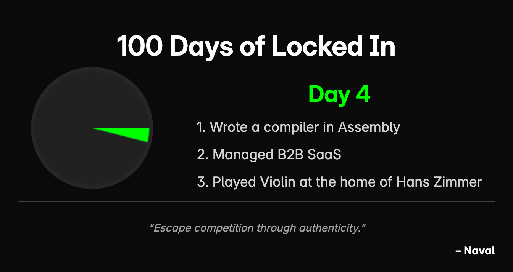

# 100 Days of LockedIn



A minimal, aesthetic website to **track your 100-day journey** and **share your progress** visually with a PNG badge.

## 🔗 Live Demo

👉 [https://100-days-of-locked-in.vercel.app](https://100-days-of-locked-in.vercel.app)

## ✨ Features

- 🎯 Track your daily progress for 100 days
- 📊 Dynamic pie chart visualization of your journey
- 📸 One-click PNG download of your progress chart
- 🌙 Dark mode friendly & responsive design
- ⚡ Built with HTML, TailwindCSS, and JavaScript

## 📷 Preview


## 🚀 How to Use

1. Enter your progress (0–100)
2. Watch the chart update in real-time
3. Click "Download as PNG" to share your journey

## 🛠️ Built With

- [Tailwind CSS](https://tailwindcss.com/) – for styling
- [HTML5](https://developer.mozilla.org/en-US/docs/Web/Guide/HTML/HTML5) – markup
- [JavaScript](https://developer.mozilla.org/en-US/docs/Web/JavaScript) – interactivity
- [html2canvas](https://html2canvas.hertzen.com/) – for PNG export

## 📦 Run Locally

```bash
git clone https://github.com/your-username/100-days-of-locked-in.git
cd 100-days-of-locked-in
npm install
npx tailwindcss -i ./src/input.css -o ./src/output.css --watch
# Open src/index.html in browser
```

## 🙌 Contribute

Pull requests welcome! For major changes, open an issue first to discuss what you’d like to change.
